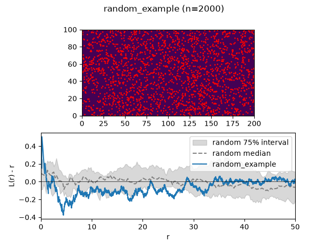
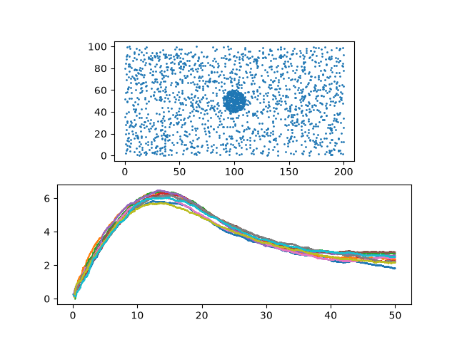
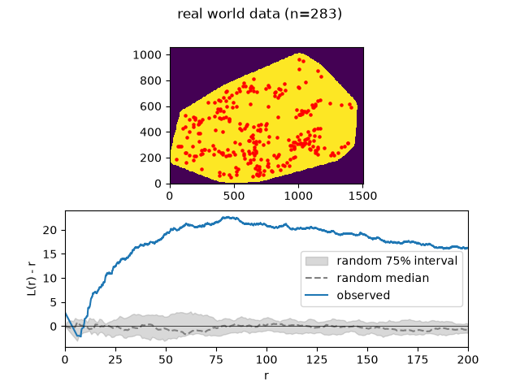

# Ripley-py
Performs 2D ripley analysis of points inside a masked area.
Edge correction is performed in accordance with the description by Peter Haase (1995)
> Edge corrections by weighting It(uij) were employed by
Getis & Franklin (1987) and Andersen (1992). The
weighting factor wij is equal to the proportion of the
circumference of the circle with radius uij and centred on
point i and passing through j, that lies within the plot
boundaries.

This is approximated by 256 points on a circle.

# Examples
Each example plots the masked area with the points on top, and below it the
observed L(r) - r curve against the random-noise floor (median +/- 75%
interval from repeated random draws in the same mask).

## Example images 1
Generated with [example1.py](example1.py)

### Random

### Clustered

## Example images 2
Generated with [example2.py](example2.py)

### Real world data
Mask from convex hull of the points

