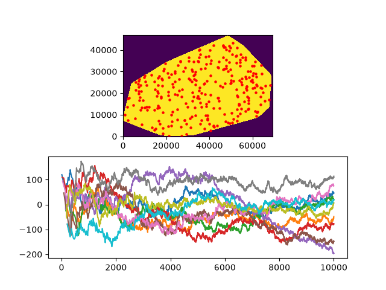

# Ripley-py
Performs 2D ripley analysis of points inside a masked area.

## Example images 1
Generated with [example1.py](example1.py)

### Random

### Clustered

## Example images 2
Generated with [example2.py](example2.py)

### Real world data
Mask from convex hull of the points

### Randomized data
Generated 10x in the same mask

